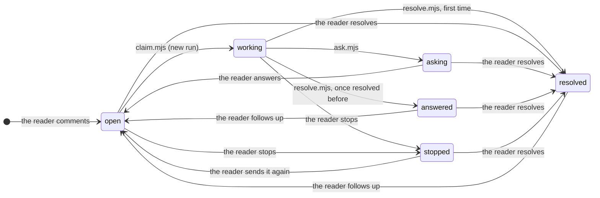

# The comments file and the step files

Code Buddy keeps two kinds of files for a project:

| File | Where | Holds | Written by |
| --- | --- | --- | --- |
| `comments.json` | In the project, at `commentsFile` of `.code-buddy.json` (`.code-buddy/comments.json` by default; `CODE_BUDDY_COMMENTS_FILE` overrides it) | The discussions: every comment, its thread, its state and the history of its moves | The store (`scripts/lib/store.mjs`), for the server and the agents' scripts |
| `<id>.jsonl` | In the state folder, `<state>/<hash>/progress/` | The steps of the run in progress on comment `<id>` | The hooks (`hooks/register.ts`) |
| `<id>.history.jsonl` | Next to it | The steps of every run that ended, with a dev build of the widget only | The store, when a run ends |

`<state>` is `CODE_BUDDY_STATE_DIR`, else `$XDG_CACHE_HOME/code-buddy`, else
`~/.cache/code-buddy`. `<hash>` is the first 12 hex digits of the SHA-1 of the
project's root: each project has its own folder. Deleting a comment deletes
its step files; `comments.json` never holds a step.

The reference for the comments file is
[`skills/code-buddy/scripts/lib/format.mjs`](../skills/code-buddy/scripts/lib/format.mjs):
its version, states, moves and JSDoc types. The widget mirrors them in
`skills/code-buddy/widget/src/domain.ts`.

## `comments.json`

### The envelope

```jsonc
{ "version": 2, "comments": [ /* Comment, oldest first */ ] }
```

Any other `version`, or a bare array (version 1), is refused and left
untouched: the server stops with `COMMENTS_REFUSED old comments format: delete
<file>`, and the scripts print the same message.

### A comment

```jsonc
{
  "id": "b96fae58-5cc3-426b-9632-77f3a7f8f866",
  "route": "/",                              // "*": about the whole app
  "url": "http://localhost:5190/",           // the page, query and hash included
  "anchor": {
    "section": "Coffee roasted the week you drink it", // the heading above it
    "quote": "",                             // the selected text; "" when none
    "occurrence": 0,                         // which occurrence of the quote
    "element": {                             // when the reader pointed at one
      "selector": "#root > main > section:nth-of-type(1) > h1",
      "tag": "h1",
      "text": "Coffee roasted the week you drink it",
      "html": "<h1>Coffee roasted the week you drink it</h1>"
    }
  },
  "state": "resolved",                       // always the last event's
  "createdAt": "2026-10-10T15:44:37.597Z",   // equals messages[0].at
  "messages": [ /* Message */ ],
  "events": [ /* Event */ ],
  "cancellation": { /* the last stopped run, when there is one */ }
}
```

| Field | Type | Notes |
| --- | --- | --- |
| `id` | string | A UUID. |
| `route` | string | The page's path, or `*` for the whole app. |
| `url` | string, optional | Up to 2000 characters. |
| `anchor.section` | string | Up to 300 characters. |
| `anchor.quote` | string | Whitespace-collapsed, up to 2000 characters. |
| `anchor.occurrence` | integer ≥ 0 | |
| `anchor.element` | object, optional | `selector` (500), `tag` (20), `text` (200) and `html` (600), truncated. |
| `state` | State | See [States](#states-and-moves). |
| `createdAt` | ISO date | Lists sort by it. |
| `messages` | Message[] | The whole thread, the reader's comment first. |
| `events` | Event[] | Every move, oldest first, never overwritten. |
| `cancellation` | Cancellation, optional | Kept after a re-send, so the next agent sees it. |

### A message

```jsonc
{ "id": "m1", "author": "reader", "body": "change le titre", "at": "…" }
{ "id": "m2", "run": "r1", "author": "claude", "question": true,
  "body": "Quel nouveau titre veux-tu ?",
  "options": [{ "label": "Café torréfié la semaine où tu le bois", "description": "traduction en français" }],
  "at": "…" }
{ "id": "m3", "author": "reader", "body": "Café torréfié la semaine où tu le bois",
  "choices": ["Café torréfié la semaine où tu le bois"], "at": "…" }
{ "id": "m4", "run": "r2", "author": "claude", "body": "Le titre est changé.", "at": "…" }
```

| Field | Type | Notes |
| --- | --- | --- |
| `id` | `m1`, `m2`… | In sequence within the comment. |
| `author` | `reader` or `claude` | |
| `body` | string | |
| `at` | ISO date | |
| `run` | `r1`, `r2`…, Claude only | The run that wrote it. |
| `question` | `true`, Claude only | A question rather than an answer. |
| `options` | `{ label, description? }[]`, a question only | 2 to 6, distinct labels; the reader may answer in their own words instead. |
| `multiple` | `true`, with `options` | The reader may pick several. |
| `choices` | string[], reader only | The options they picked, also written at the start of `body`. |

### An event

```jsonc
{ "at": "2026-10-10T15:44:57.469Z", "state": "working", "by": "agent", "run": "r1" }
```

| Field | Type | Notes |
| --- | --- | --- |
| `at` | ISO date | |
| `state` | State | The state the comment moved to. |
| `by` | `reader`, `agent` (`server` is reserved) | Who moved it. |
| `run` | `r1`, `r2`…, optional | The run it belongs to. Each `working` event starts one. |

### A cancellation

```jsonc
{ "at": "2026-10-10T15:52:19.733Z", "changed": ["src/data.ts"], "steps": 2, "run": "r6" }
```

`at` is the time of its `stopped` event. `changed` lists the files the stopped
run had written, relative to the repository: a failed write is not counted,
and one cut short by the stop is. `steps` counts its tool calls, not its
thinking or messages.

### States and moves

| State | Means |
| --- | --- |
| `open` | Waiting for an agent. |
| `working` | An agent claimed it: a run is in progress. |
| `asking` | Claude asked the reader a question. |
| `answered` | Claude answered a follow-up on a thread resolved before: the reader follows up again or resolves it. |
| `stopped` | The reader stopped the run. |
| `resolved` | Done. |



| Move | Trigger | `by` | Also writes |
| --- | --- | --- | --- |
| `open → working` | `claim.mjs` | agent | A new `run` in the event. Claimed again while working, it stays in its run. |
| `working → asking` | `ask.mjs` | agent | A `claude` message with `question` and `run`. |
| `working → resolved` | `resolve.mjs`, on a thread never resolved | agent | A `claude` message with `run`. |
| `working → answered` | `resolve.mjs`, on a thread resolved before | agent | A `claude` message with `run`. |
| `open` or `working → stopped` | PATCH `cancelled: true` | reader | The `cancellation`, with the `run`. |
| `asking`, `answered` or `resolved → open` | PATCH `followUp` and/or `choices` | reader | A `reader` message. |
| `stopped → open` | PATCH `cancelled: false`, or a `followUp` | reader | With `text`, the last `reader` message's new words, its `choices` dropped. |
| `open`, `asking`, `answered` or `stopped → resolved` | PATCH `status: "resolved"` | reader | Nothing else. |

The store refuses any other move, and writes nothing: the server answers 409
with the reason (`comment <id> is resolved`), which the widget shows. Two
exceptions, as a click a poll late or twice is no error: a stop on a comment
no longer `open` or `working`, and a re-send of one no longer `stopped`,
change nothing. `ask.mjs` and `resolve.mjs` on a comment still `open` claim it
first (`open → working`).

The page marks a comment's anchor (an element's outline, a text's rainbow)
until its thread is first resolved: a follow-up does not bring it back.

## The step files

One JSON object per line. A tool writes one line when it starts and one when
it ends or fails, with the same `id`: readers merge them into one step, in the
place where it started. The agent's thinking and messages have no `id` and
one line each.

```jsonc
{"at":1791647537691,"id":"toolu_01Mk9U…","kind":"read","label":"src/data.ts","state":"running","run":"r6"}
{"at":1791647537702,"id":"toolu_01Mk9U…","kind":"read","label":"src/data.ts","state":"done","run":"r6"}
{"at":1791647539037,"kind":"thinking","label":"","run":"r6"}
```

| Field | Type | Notes |
| --- | --- | --- |
| `at` | number | Milliseconds since the epoch. |
| `kind` | string | `start` (the claim), `read`, `edit`, `write`, `multiedit`, `bash`, `search`, `web`, `mcp`, `skill`, `tool` (any other tool), `thinking`, `message`. |
| `label` | string | The file, from the project; the command's description; the pattern, the host, `server · tool`… Empty for thinking the API redacted. Up to 400 characters for thinking and messages. |
| `id` | string, tools only | Claude Code's `tool_use_id`: the debug panel finds the call in the transcripts with it. |
| `state` | `running`, `done` or `failed`, tools only | |
| `error` | string, optional | Why it failed: the first line of the tool's error, or the hooks' reason (a lock held by another comment's agent, a write from Bash). |
| `run` | `r1`, `r2`… | The run it belongs to: the hooks write it from `claim.mjs`'s output, and the store adds it to untagged steps when it archives them. |

`<id>.jsonl` exists only while a run is in progress. When the run ends
(`ask.mjs`, `resolve.mjs`, a stop, the reader resolving), the store moves its
lines to `<id>.history.jsonl` with a dev build of the widget, or drops them,
and the hooks add the ending script's own step, done, to the history.

The server never writes steps into `comments.json`. It serves them with the
comments: `progress`, the last 10 steps of the run in progress, and with
`history=1` (the debug panel), `history`, every step of every run. With a dev
widget, `GET /api/debug/steps/<id>` serves both files as they are on disk,
history first, which the debug panel opens in a tab.
